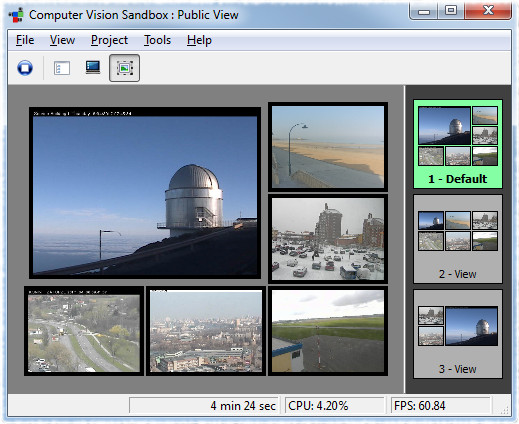
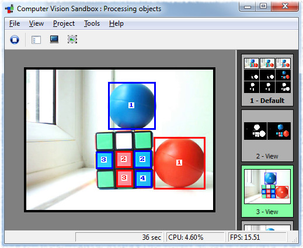
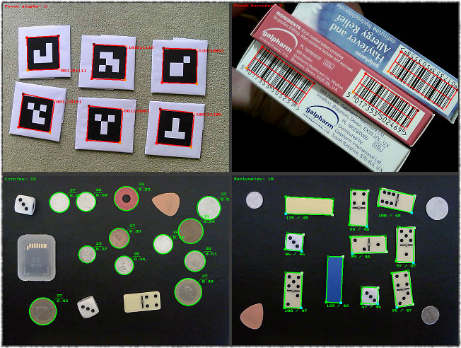

# Computer Vision Sandbox

Computer Vision Sandbox is a software package, which aims to allow solving different tasks related to computer vision areas, like, for example, video surveillance, vision based automation/robotics, different sorts of image/video processing, etc.

The idea of the software is its great modularity. The main application itself does little on its own - it represents a building platform. However, being combined with the vast range of plug-ins it may accomplish great range of tasks. Plug-ins represent building blocks and the type of blocks chosen and the way those are used determine what the software does. The idea is to provide users with a building platform and let them construct their goal.

So, what are the plug-ins? Since it is all around computer vision, the video source plug-ins play the central role in the system. There are plug-ins to access different types of cameras, like USB web cameras, video capture boards, IP video surveillance cameras, etc. Once video is received, there is great variety of plug-ins to perform different image and video processing. Combined together those allow achieving many interesting results. On top of that, there is scripting support, which allows to do even more by programming custom scripts utilizing the variety of plug-ins. Future releases will extend scripting API even more, bring more image/video processing plug-ins and introduce device plug-ins to talk to some robotics boards/controllers and other hardware - this is when the real fun comes.

So, to repeat, it is all about building blocks and connecting them to solve the task. And if the system does not talk to certain camera model, does not perform some required image or video processing, etc. - add a plug-in and it will do so. Well, this is the goal. 

Below is a quick screen shot of the Computer Vision Sandbox showing six different IP cameras:

Another one from a different area - locating and counting objects of different colors:

Some more examples from other areas of computer vision:

Visit the [project’s web site](http://www.cvsandbox.com/) to find more information about Computer Vision Sandbox, its features, tutorials on using it and latest releases.
